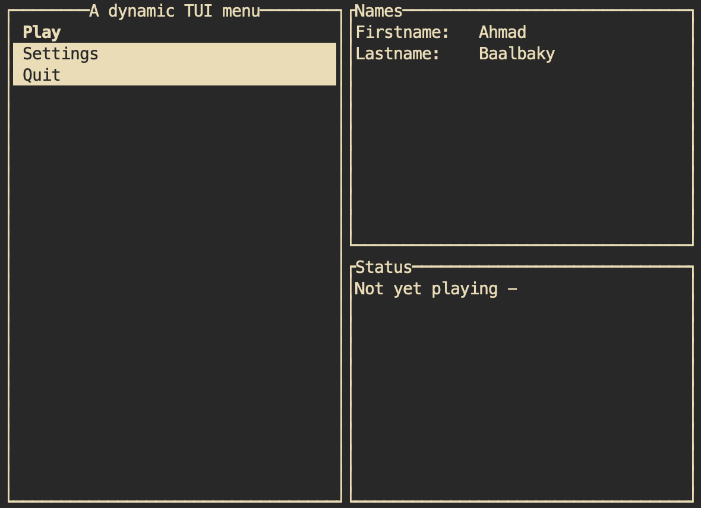

<div style="text-align: center;">

# Ezmenu library &emsp; [](./LICENSE) [](https://crates.io/crates/ezmenulib) [](https://docs.rs/ezmenulib)

</div>

Building CLI menus in Rust becomes easy and fast.

This repository contains the source code of the ezmenulib crate. This crate provides a library that allows you to build console menus and other prompted resources such as passwords, boolean values, written and selected values, and more. It includes type-checking from the user input, and a prompt format customization.

This crate is useful to put beside [clap](https://docs.rs/clap/) crate, to manage the case where the user hasn't provided any command argument.

For now, this crate only helps to draw menus in the console. It allows you to not spend time on printing from scratch any form of prompt to the user. If you're making a console application, you *must* use this crate.

The built menus are useful for a game mode selection for example. It allows you to map functions when the user selects the corresponding field. It also let you mutate your code depending on the user input.

## Provided Cargo features

This crate comes with many features:

* `derive` (enabled by default): provides derive and attribute macros.
* `password` (enabled by default): provides types to prompt a password from the user.
* `tui`: opens the `ezmenulib::tui` module letting you build interactive menus.
* `crossterm` and `termion`: backends to provide beside the `tui` feature.
* `extra-globals`: allows you to use [parking_lot](https://docs.rs/parking_lot/) types with the `derive(Menu)` macro, thus needs to be provided with the `derive` feature.

Without any feature enabled, the ezmenulib crate is very lightweight and has no dependency. You still can build non-interactive menus and prompt values from the user with simple instructions.

## Basic usage

### Asking values from the user

First, for more convenience, you may want to import the ezmenulib prelude when using the crate:

```rust
use ezmenulib::prelude::*;
```

Then, to ask the name of the user for example, you simply need to provide this instruction:

```rust
let name: String = Written::new("What is your name?").get();
```

This instruction, when executed, will result to this output:

```text
--> What is your name?
>> 
```

`Written` is a struct that implements the `Promptable` trait. This trait is implemented by all the types that prompts a message to the user, then returns the value he entered. It includes type-checking, and loops until the provided value is correct and not empty.

If you want to get an optional value, meaning an `Option<T>` as the output type, you can use the `Promptable::get_optional` associated function, and it will return `Some(value)` if the user provided a correct value, otherwise it will return `None`.
If you want to get the default value of the type if the user entered an incorrect value, you can use the `Promptable::get_or_default` associated function.

There exist many promptable types. You can ask the user for specific values by presenting him available responses, so the user only needs to select the desired field:

```rust
let amount: u8 = Selected::new("How many?", [("only one", 1), ("two", 2), ("none", 0)]).get();
```

When executed, this instruction will result to this output:

```text
--> How many?
[1] - only one
[2] - two
[3] - none
>> 
```

#### The `Prompted` trait

The `Prompted` trait is implemented on a type that results of a prompt on the console. In general, it is implemented with the `derive(Prompted)` macro. This derive macro can be placed on an enum or a struct to allow it to be built from the user inputs in the console:

```rust
#[derive(Prompted)]
enum LicenseType {
    #[prompted(default)]
    MIT,
    GPL,
    BSD,
}

let ty = LicenseType::prompt();
```

This code will result to this output:

```text
--> License type
[1] - MIT (default)
[2] - GPL
[3] - BSD
>> 
```

In this case, the `default` parameter in `#[prompted(default)]` means that if the user enters an incorrect value, then it will return the `LicenseType::MIT` value.

For more information, see the [docs.rs](https://docs.rs/ezmenulib/) documentation.

### Menus

A basic example of how to build a CLI menu in Rust is to modelize a game main menu, with a first "Play" button, a button for the "Settings", and an other used to "Quit" the program.

The "Play" button will call a function when selected to begin the game loop.
The "Settings" button will run a nested menu with a "Name" button used to edit the name of the user, a "Main menu" button used to return back to the main menu, and a "Quit" button used to quit the program.

The "Name" nested field in the Settings menu will itself lead to an other nested menu, with a "Firstname" button used to run the program that edits the firstname of the current player, a "Lastname" button for his lastname, and a "Main menu" button to return to the main menu.

With `ezmenulib`, this menu is very easy to build:

```rust
use ezmenulib::{bound, menu::Menu};

#[bound]
fn edit_name(span: &str) -> {
    println!("Editing {span}name");
    // edit the name...
}

#[derive(Menu)]
enum Name {
    #[menu(mapped(edit_name, "first"))]
    Firstname,
    #[menu(mapped(edit_name, "last"))]
    Lastname,
    #[menu(back(2))]
    MainMenu,
}

#[derive(Menu)]
enum Settings {
    #[menu(parent)]
    Name,
    // Elided index means it goes back to the previous depth
    // Equivalent to #[menu(back(1))]
    #[menu(back)]
    MainMenu,
    Quit,
}

#[bound]
fn play() {
    println!("Now playing");
    // loop { ... }
}

#[derive(Menu)]
enum MainMenu {
    #[menu(map(play))]
    Play,
    #[menu(parent)]
    Settings,
    Quit,
}

MainMenu::run();
```

Then, a sample of the resulted output of this code would be:

```text
--> Main menu
[1] - Play
[2] - Settings
[3] - Quit
>> 1
Now playing
--> Main menu
[1] - Play
[2] - Settings
[3] - Quit
>> 2
--> Settings
[1] - Name
[2] - Main menu
[3] - Quit
>> 1
--> Name
[1] - Firstname
[2] - Lastname
[3] - Main menu
>> 1
Editing firstname
--> Name
[1] - Firstname
[2] - Lastname
[3] - Main menu
>> 3
--> Main menu
[1] - Play
[2] - Settings
[3] - Quit
>> 3
```

However, this menu remains very simple and looks like ["raw" menus](https://docs.rs/ezmenulib/1.0.0/ezmenulib/menu/struct.RawMenu.html).

So, this raw menu may be transformed into an interactive menu that can be drawn by the [`tui`](https://docs.rs/tui/0.19.0) library. The menu will then appear like so, depending on your code context:



This output corresponds to the ["dynamic tui-menu"](examples/dynamic_tuimenu.rs) example.

For more information about the `ezmenulib` menus, see the [docs.rs](https://docs.rs/ezmenulib/1.0.0/ezmenulib/menu/trait.Menu.html) documentation.

## Formatting customization

The library allows you to customize the text format behavior in many ways. The rules are defined in the [`Format` ](https://docs.rs/ezmenulib/1.0.0/ezmenulib/field/struct.Format.html) struct.

You may remove the line break between the prompt and the suffix before the user input for example:

```rust
use ezmenulib::prelude::*;

let name: String = Written::from("Name")
    .format(Format {
        line_brk: false,
        suffix: ": ",
        ..Default::default()
    })
    .get();
```

This custom format specification results to this output:

```text
--> Name:
```

The format can be global and inherited by the [`Values`](https://docs.rs/ezmenulib/1.0.0/ezmenulib/menu/struct.Values.html) container on the called promptable types (written, selected, etc). If a promptable has its own custom format specification, the container will save it.

## Documentation

You can find all the crate documentation on [docs.rs](https://docs.rs/ezmenulib).
You can also check the [examples](examples) to learn with a practical way.
